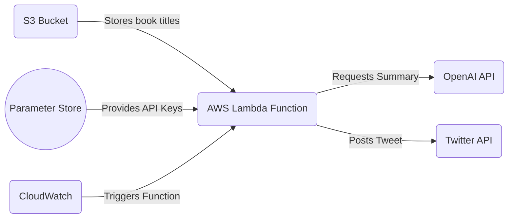

# AI-Powered Book Summary Twitter Bot with AWS

This project is a Twitter bot that posts tweet summaries of books. It does so by leveraging AWS Lambda for scheduling and execution, an AWS S3 bucket for storage of book titles, AWS Systems Manager Parameter Store for secrets management, AWS CloudWatch for logging, and the OpenAI API for generating book summaries.

## Screenshots

*(placeholder for screenshots)*

Please replace this text with the actual screenshots of the project. Make sure to include visuals of both the AWS components and the resulting tweets posted on Twitter.

## Diagram

The following diagram describes the interaction between different components:

## Prerequisites

Before you can deploy this project, you need:

- An AWS account
- A Twitter Developer account
- Access to OpenAI API

## Setup

Follow these steps to set up and run this project:

1. **AWS Configuration**
   - Create an S3 bucket for storing book titles. Each book title should be on a new line in a text file with the name `data.txt`.
   - Store your secrets (Twitter API keys, OpenAI API key) in AWS Systems Manager Parameter Store. The following keys should be stored:
     - `/TwitterBot/consumer_key`
     - `/TwitterBot/consumer_secret`
     - `/TwitterBot/access_token`
     - `/TwitterBot/access_token_secret`
     - `/TwitterBot/OPENAPI_API_KEY`

2. **Twitter Developer Account Configuration**
   - Create a Twitter Developer account if you haven't done so already. Once you've created the account, create a new app to obtain your API keys. These keys should be stored in AWS Systems Manager Parameter Store as stated above.

3. **OpenAI API Configuration**
   - Sign up for access to the OpenAI API if you haven't done so already. Once you've been granted access, you can find your API key on the OpenAI dashboard. This key should also be stored in AWS Systems Manager Parameter Store.

4. **Deployment**
   - Deploy the lambda function using your preferred method (AWS CLI, AWS Console, Infrastructure as code tools like AWS SAM or Serverless Framework). Remember to set the `BUCKET_NAME` environment variable to the name of the S3 bucket you created earlier.
   - Setup a CloudWatch rule for triggering the Lambda function at regular intervals.

## Code Structure

- The `get_parameter()` function is used for fetching values stored in AWS Systems Manager Parameter Store.
- The `get_book_title()` function fetches a random book title from the `data.txt` file stored in your S3 bucket.
- The `lambda_handler()` function is the main function that's triggered when the Lambda function runs. It performs the following tasks:
  - Fetch API keys from AWS Systems Manager Parameter Store.
  - Setup the OpenAI API client.
  - Fetch a random book title.
  - Generate a book summary using the OpenAI API.
  - Post the book summary as a tweet.

## Notes

- Make sure the role attached to the Lambda function has necessary permissions for the S3 bucket, CloudWatch Logs, and Systems Manager Parameter Store.
- The OpenAI model used for generating book summaries is `text-davinci-003`. You can change this to any other model you prefer.

## Resources

1. [AWS Lambda](https://aws.amazon.com/lambda/)
2. [AWS S3](https://aws.amazon.com/s3/)
3. [AWS Systems Manager Parameter Store](https://docs.aws.amazon.com/systems-manager/latest/userguide/systems-manager-parameter-store.html)
4. [Twitter Developer Account](https://developer.twitter.com/)
5. [OpenAI API](https://openai.com/research/)

## License

This project is released under the MIT License. Please see the `LICENSE` file for details.

## Support

If you have any questions or run into any issues, please open an issue on this GitHub repository.com
